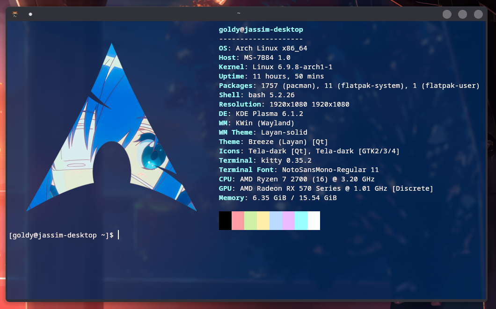

<div align="center">

  # ✨ .dotfiles

  <sub>My current dotfiles. I only really use this to sync my config files and share wallpapers atm.</sub>

  

  <br>

</div>

Hi this is Goldy and this is where I store my Linux dotfiles. Nothing really special here though, just some configs and wallpapers I like carrying around different systems but my dotfiles are public just in case anyone wants anything from it.

I've designed the repo in such a way you can just pick and choose what you wanna add to your existing system. I recommend [GNU stow](https://www.gnu.org/software/stow/) to achieve this. 

For example, you want my wallpapers? CD into my repo and symlink them with `stow`:
```sh
stow wallpapers
```
> It should be in your ~/Pictures folder now.

Then if you want to remove it, run this:
```sh
stow -D wallpapers
```

and etc etc...

## Fastfetch config

<div align="center">

  

</div>

```sh
stow kitty fastfetch
```