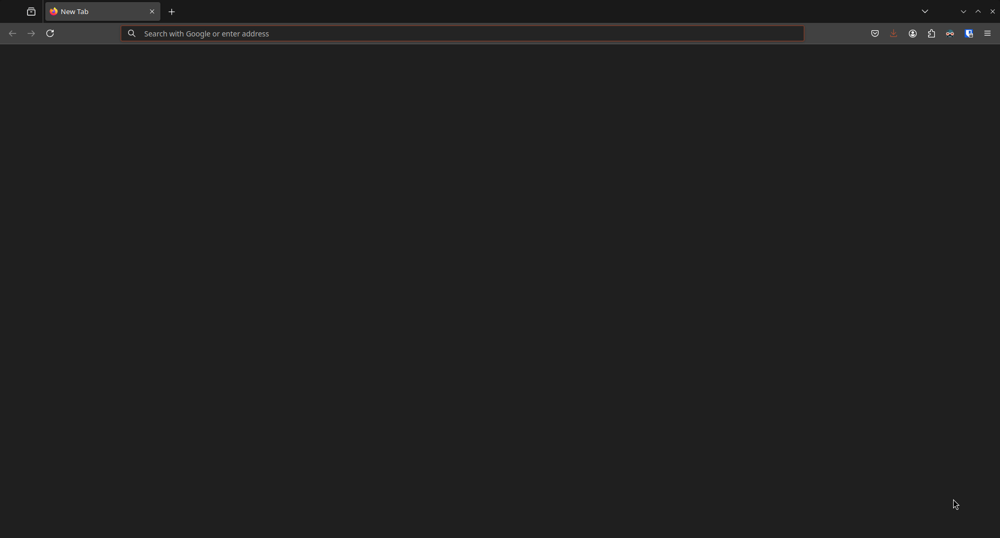

<div align="center">

  # ✨ .dotfiles

  <sub>My current dotfiles. I only really use this to sync my config files and share wallpapers atm.</sub>

  

  <br>

</div>

> [!WARNING]
> You must cd into one of the parent directories listed below or when I say "CD", as each one of these directories tells GNU stow where to dump the dotfiles.

Hi this is Goldy and this is where I store my Linux dotfiles. Nothing really special here though, just some configs and wallpapers I like carrying around different systems but my dotfiles are public just in case anyone wants anything from it.

```
├── user (Home dir stuff: '.config/', '.inputrc', 'Pictures', etc)
│   ├── gnu
│   ├── kitty
│   ├── fastfetch
│   ├── wallpapers
│   └── ...
├── system (Root directory stuff: '/etc' and so on)
│   ├── libvirt
│   └── ...
├── laptop-user (Home dir but laptop specific)
│   ├── kitty
│   ├── fastfetch
│   └── ...
├── desktop-user (Home dir but desktop specific)
│   ├── kitty
│   ├── fastfetch
│   └── ...
```

I've designed the repo in such a way you can just pick and choose what you wanna add to your existing system. I recommend [GNU stow](https://www.gnu.org/software/stow/) to achieve this. 

For example, you want my fastfetch and kitty config? CD into my repo, then cd into "user" and symlink them with `stow`:
```sh
cd user
stow kitty fastfetch
```


Then if you want to remove them, run this:
```sh
stow -D kitty fastfetch
```

and etc etc...

## Firefox


```sh
cd user
stow firefox

# Append goldy-custom firefox profile into your firefox profiles config
cat ~/.mozilla/firefox/gc_profiles_append.ini >> ~/.mozilla/firefox/profiles.ini
```

Open tabs to the home pages of all the extenions I use in firefox:
```sh
xargs -a ~/.mozilla/firefox/gc_ext.txt -I {} firefox "{}" &
```

## Wallpapers


```sh
git submodule init && git submodule update

cd user
stow wallpapers
```
> They should be in your ~/Pictures folder now.

If I add new wallpapers at [my wallpapers repo](https://github.com/THEGOLDENPRO/wallpapers) and you would also like them just update the submodule like so:
```sh
git submodule update --remote
```
